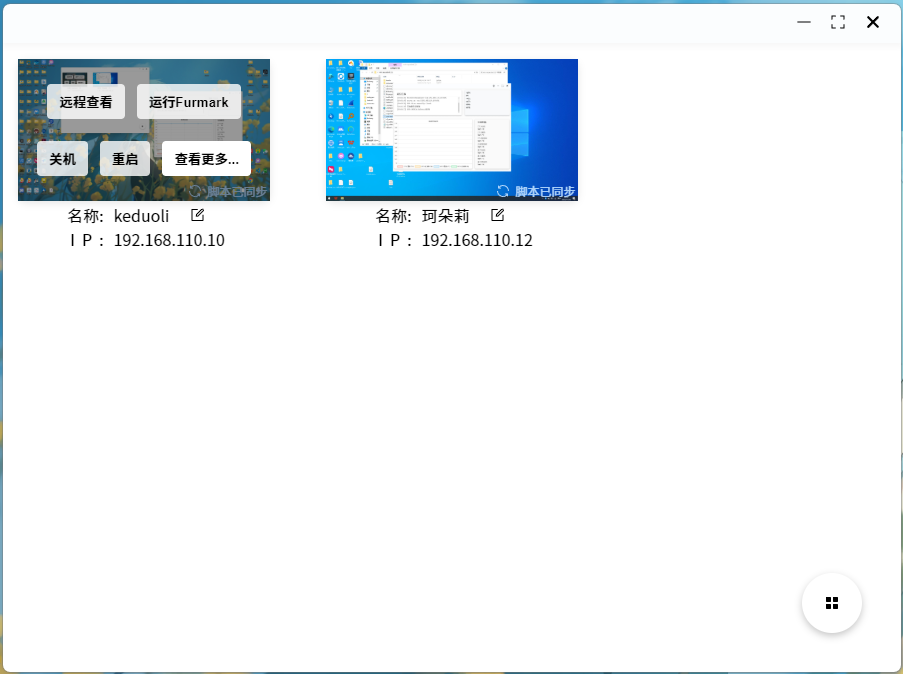
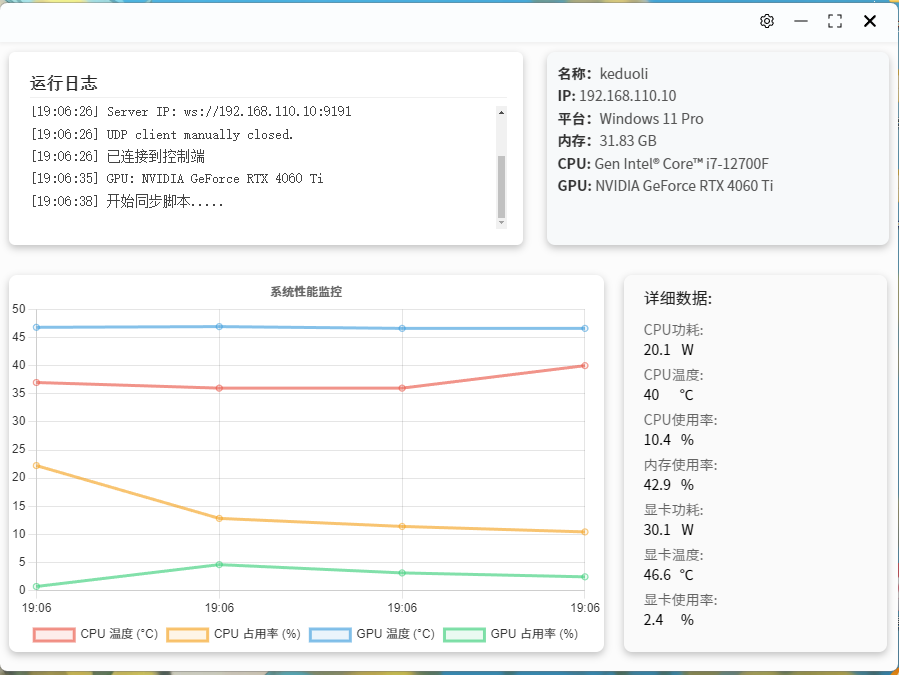

### 基于electron编写的局域网多设备控制工具

+ 远程控制 基于[UltraVNC](https://uvnc.com/downloads/ultravnc.html)
+ 设备桌面预览 基于[screenshot-desktop](https://github.com/bencevans/screenshot-desktop)截图实现
+ 数据状态获取 基于[systeminformation](https://www.npmjs.com/package/systeminformation),[@keduoli-q/hardware-monitor](https://www.npmjs.com/package/@keduoli-q/hardware-monitor)

### rootTool

### userTool

